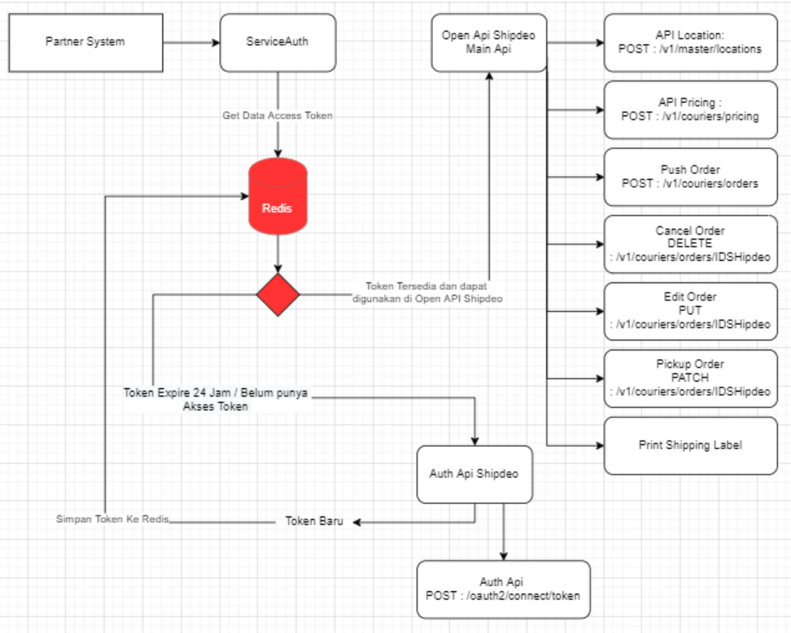

# Shipdeo
Integrasion Shipping Indonesia with shipdeo, 

## Official Website

* [Shipdeo](http://www.shipdeo.com?referral=s-node.js) - Website Shipdeo
* [Portal Shipdeo](https://portal.shipdeo.com/register?referral=s-node.js) - access for User Shipdeo
* [Contact Us](https://api.whatsapp.com/send/?phone=6287897759000&text&type=phone_number&app_absent=0) - our Customer Service

### Courier List
Courier list is a service that displays a list of available couriers along with the courier code. The courier code will later be used when accessing the Tracking, Pricing and Order API. The following is the courier code on shipdeo:

#### Reguler & Cargo Courier

| code      | courier name   |
| --------- | -------------- |
| sicepat   | Sicepat Ekspres|
| jne       | JNE Express    |
| ninja     | Ninja Express  |
| sap       | SAP Express    |
| jnt       | J&T Express    |
| anteraja  | Anteraja       |
| sc        | Sentral Cargo  |
| idx       | ID Express     |

#### Instant Courier

| code      | courier name   |
| --------- | -------------- |
| gosend    | GoSend         |
| grab      | Grab Express   |


## Getting Started
For install our library
```bash
npm i shipdeo
```

### Prerequisites

For API integration, we divide it into 3 stages as follows:

1. Setup auth and master data
2. Order API integration
3. Webhook integration

After carrying out all the steps above, integration testing or UAT can be carried out with the Shipdeo team to ensure that the data sent to Shipdeo is appropriate. To minimize problems in the future, it is recommended to release to production after carrying out UAT with the Shipdeo team.

### Get Credential Shipdeo
The following is how to get the `clientId` and `clientSecret` on the shipdeo portal.
1.  Login and access the shipdeo apps page
2. Fill in the integration form
    - Enter the name of your webstore
    - In he platform option select `Integration`
    - In the courier column, select the courier you want to activate
    - Select `order` to use all shipdeo features on the webstore
3. Click save and contact the shipdeo support team to activate the integration
4. If the account is active, you can get the `clientId` and `clientSecret` on the integration details page as below

Based on the  `clientId` and `clientSecret` that you have, you can request an `accessToken`. `accessToken` is a Bearer Token which will later be used as a credential to access Shipdeo Main API and accessToken will `expire in 24 hours`.

### Auth
Service for generate `accessToken`, example
```javascript
const { ShipdeoAuth } = require("shipdeo");

const clientId = 'yourClientID';
const clientSecret = 'yourClientSecret';
const baseAuthUrl = 'https://auth-api-development.shipdeo.com';

const client = new ShipdeoAuth(baseAuthUrl, clientId, clientSecret);

client.getToken()
  .then(token => console.log('Token:', token))
  .catch(err => console.error('Error:', err));

```

#### Auth implementation recommendations


### Ongkir
Service for get ongkir , example: 
```Javascript
const { ShipdeoCore } = require("shipdeo");
const ShippingItemRequest = require("shipdeo/model/request/shipping-item.req");
const ShipmentRequest = require("shipdeo/model/request/shipping.req");

const accessToken = "80d7c9dd62be00ae392c8b13989eecbf00862ce5";
const baseUrl = "https://main-api-development.shipdeo.com"

const shipdeoCore = new ShipdeoCore(baseUrl, accessToken);

const item = new ShippingItemRequest({
    "value": 100000,
    "height": 11,
    "width": 11,
    "length": 11,
    "weight": 1,
    "qty": 1,
    "weight_uom": "kg",
    "dimension_uom": "cm",
    "name": "Baju Kerja",
    "description": "ini baju kerja",
    "is_wood_package": false
})
const shippingRequest = new ShipmentRequest({
    "couriers": [
        "ninja", "sicepat"
    ],
    "is_cod": false,
    "origin_subdistrict_code": "31.71.01",
    "origin_subdistrict_name": "GAMBIR",
    "origin_city_code": "31.71",
    "origin_city_name": "KOTA ADM. JAKARTA PUSAT",
    "origin_lat": -6.1737996,
    "origin_long": 106.8266873,
    "destination_subdistrict_code": "31.73.07",
    "destination_subdistrict_name": "PAL MERAH",
    "destination_city_code": "31.73",
    "destination_city_name": "KOTA ADM. JAKARTA BARAT",
    "destination_lat": null,
    "destination_long": null,
    "destination_note": "",
    "items" : [
        item
    ]
})

shipdeoCore.shipmentOngkir(shippingRequest)
  .then(data => console.log('Ongkir:', data))
  .catch(err => console.error('Error:', err));

```

### Order
Service for Create Order

```javascript
const { ShipdeoCore } = require("shipdeo");
const ItemRequest = require("shipdeo/model/request/item");
const OrderRequest = require("shipdeo/model/request/order");
const OrderTransactionRequest = require("shipdeo/model/request/order-transaction");

const order = async () => {
    try {
        const accessToken = "2949e5d484ef798e974e0884ccd261c9b88f4af5";
        const baseUrl = "https://main-api-development.shipdeo.com"

        const shipdeoCore = new ShipdeoCore(baseUrl, accessToken);
        const item = new ItemRequest({
            "value": 20000,
            "total_value": 20000, 
            "height": 11,
            "width": 11,
            "length": 11,
            "weight": 1,
            "qty": 1,
            "weight_uom": "kg",
            "dimension_uom": "cm",
            "name": "Baju Kerja",
            "description": "ini baju kerja",
            "is_wood_package": false
        })
        const orderTransaction = new OrderTransactionRequest(
            {
                "width": 30,
                "height": 10,
                "length": 10,
                "weight": 1,
                "package_category": "NORMAL",
                "package_content": "Baju Kerja",
                "coolie": 1,
                "subtotal": 20000,
                "shipping_charge": 8000,
                "fee_insurance": 0,
                "is_insuranced": false,
                "total_value": 28000,
                "total_cod": 28000,
                "discount": 0
            }
        )

        const orderRequest = new OrderRequest({
            "courier": "sicepat",
            "charge": 8000,
            "courier_service": "SIUNT",
            "is_cod": true,
            "delivery_type": "pickup",
            "delivery_time": "4/27/2024 08:31:17 PM +0000",
            "origin_subdistrict_code": "31.71.01",
            "origin_subdistrict_name": "GAMBIR",
            "origin_city_code": "31.71",
            "origin_city_name": "KOTA ADM. JAKARTA PUSAT",
            "origin_province_code": "31",
            "origin_province_name": "DKI JAKARTA",
            "origin_lat": -6.1737996,
            "origin_long": 106.8266873,
            "origin_contact_name" : "Devi",
            "origin_contact_phone" : "08200000000",
            "origin_contact_address" : "Jln Gambir",
            "origin_contact_email" : "devi@dev.com",
            "destination_subdistrict_code": "31.73.07",
            "destination_subdistrict_name": "PAL MERAH",
            "destination_city_code": "31.73",
            "destination_city_name": "KOTA ADM. JAKARTA BARAT",
            "destination_province_code": "31",
            "destination_province_name": "DKI JAKARTA",
            "destination_lat": null,
            "destination_long": null,
            "destination_contact_name" : "Devi2",
            "destination_contact_phone" : "08210000000",
            "destination_contact_address" : "Jln Palmerah",
            "destination_contact_email" : "devi2@dev.com",
            "destination_note": "Deket Apotek 24",
            "delivery_note" : "jangan di banting ya",
            "items": [
                item
            ],
            "transaction": orderTransaction
        })

  
        // Function Create Order from shipdeo Core    
        const order = await shipdeoCore.orderCreate(orderRequest);
        console.log('Orders:', order);
    } catch (err) {
        console.error('Error:', err.response.data.message)
    }
}

// Running Service
order();
```